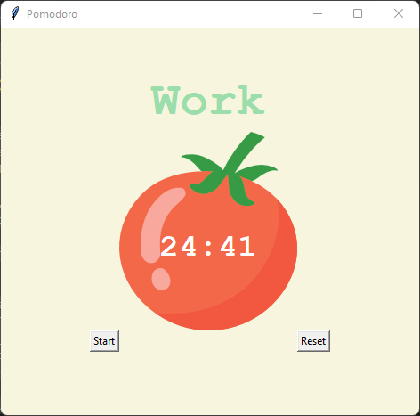

# Pomodoro Timer

A simple Pomodoro Timer application built using Python and Tkinter.

## Description

The Pomodoro Technique is a time management method that uses a timer to break work into intervals, traditionally 25 minutes in length, separated by short breaks. This application provides a graphical interface for users to easily track and manage their work and break sessions.

## Features

- Set a 25-minute timer for work sessions.
- Take short breaks of 5 minutes after each work session.
- After every 4 work sessions, take a long break of 20 minutes.
- Visual indicators for work, short break, and long break sessions.

## How to Use

1. Clone this repository to your local machine.
2. Ensure you have Python installed on your computer.
3. Run the `pomodoro.py` script using the command `python pomodoro.py` or `python3 pomodoro.py`.
4. The application window will open with a start button and a reset button.
5. Click the "Start" button to begin the timer. The timer will start with a 25-minute work session.
6. After each work session, the application will automatically switch to a 5-minute short break. During the short break, a pink "Break" label will be displayed.
7. After 4 work sessions, a 20-minute long break will be initiated. During the long break, a red "Long Break" label will be displayed.
8. You can reset the timer at any time by clicking the "Reset" button.

## Requirements

- Python 3.x
- Tkinter (should be included with most Python installations)

## Customization

You can customize the timer durations in the `pomodoro.py` script by modifying the following constants:

- `WORK_MIN`: Duration of each work session in minutes (default: 25 minutes).
- `SHORT_BREAK_MIN`: Duration of each short break in minutes (default: 5 minutes).
- `LONG_BREAK_MIN`: Duration of the long break in minutes (default: 20 minutes).

## Contributions

Contributions to this project are welcome. If you find any issues or have ideas for improvements, please open an issue or submit a pull request.

## License

This project is licensed under the MIT License. See the [LICENSE](./LICENSE) file for more details.

## Acknowledgments

The Pomodoro Technique was developed by Francesco Cirillo in the late 1980s. This project is inspired by the technique and aims to provide a digital implementation of the timer aspect of the technique. The tomato icon used in the application is a representation of the technique's name, which is derived from the tomato-shaped kitchen timer used by Francesco Cirillo during his university days.

